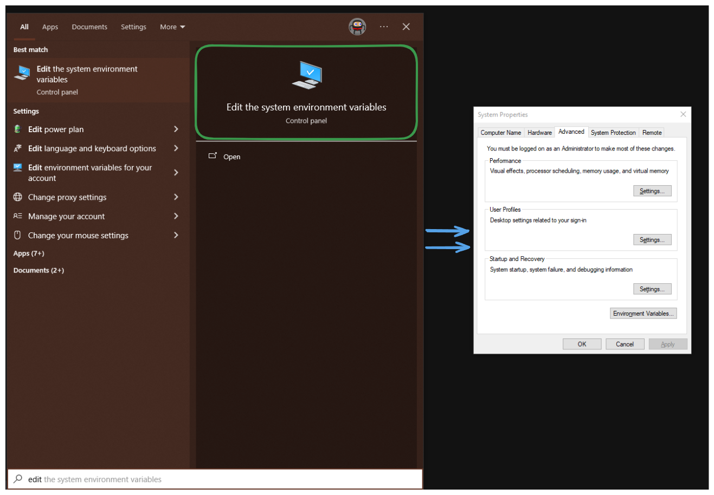
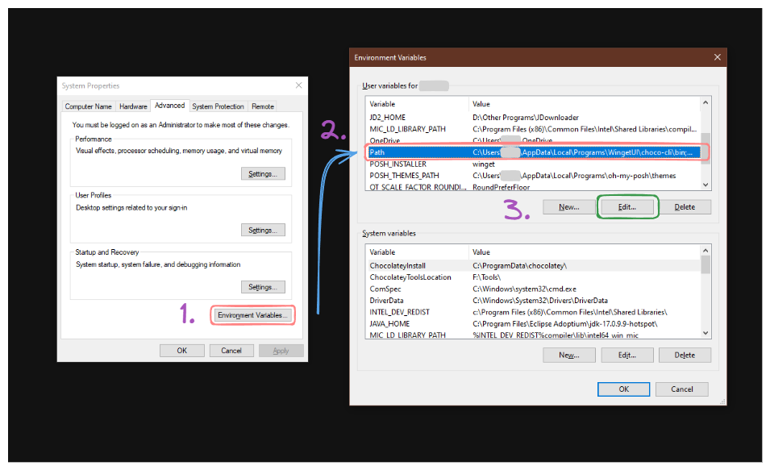
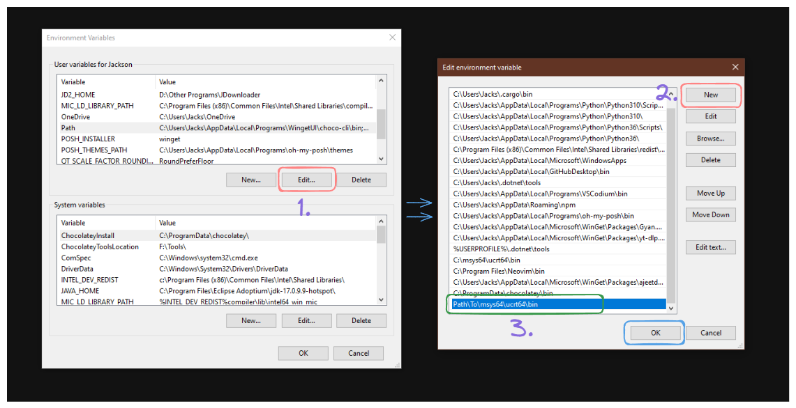
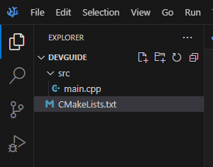
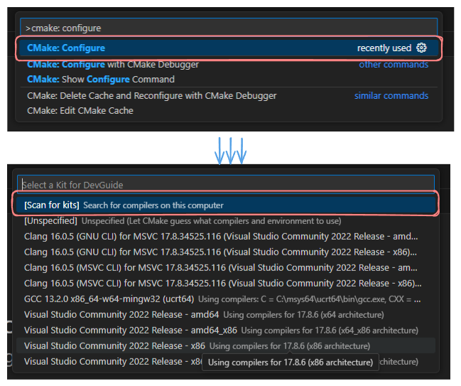
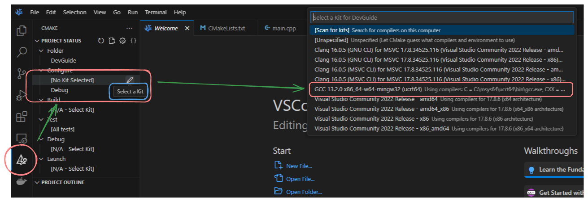
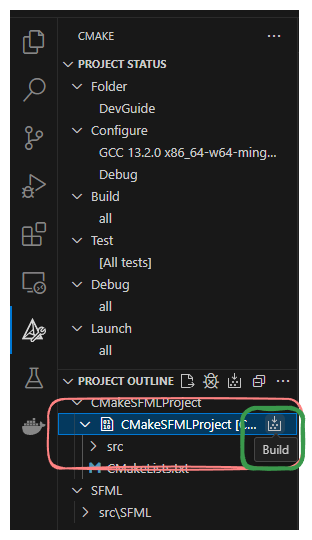

## Setting up Compilation
The steps found in this section can be found in its entirety [in the VSCode documentation](https://code.visualstudio.com/docs/cpp/config-mingw#_prerequisites). 
___
### Setting up VSCode (pt. 1)
You probably already have VSCode installed. If not, [download and install it](https://code.visualstudio.com/download). 
You also likely have the C++ extension installed. If not, it can be found [here](https://marketplace.visualstudio.com/items?itemName=ms-vscode.cpptools).
### Set Up MinGW Toolchain
MinGW provides native Windows support for many Linux tools, such as the GCC (Gnu Compiler Collection). This includes the G++ compiler, which is what you've used in WSL up until now. We're installing this in favor of MSVC, which is a Microsoft-developed compiler typically used used with Visual Studio. G++ will allow us to copy terminal commands for compilation provided by the instructor. 

Keep in mind that there are some parts of the standard library that differ between platforms. One example is the usage of `uint*x*_t`; on Linux, this can be used as-needed, but on Windows, you will need to include `cstdint.h` to use these typedefs. The C++ linter should help when dtermining platform-specific errors. 

#### Install MSYS2 
Installing G++ on Windows involves downloading [MSYS2](https://www.msys2.org/), which is used to manage the installation and updating of the tools that MinGW provides. [The installer can be downloaded here.](https://github.com/msys2/msys2-installer/releases/download/2024-01-13/msys2-x86_64-20240113.exe) 

When running the installer, choose an installation directory; I recommend something along the lines of `C:\Development\Tools`, which will make finding it easier, but this is entirely up to you (you can always reinstall to a more convenient location later). Once completed, make sure to select **Run MSYS2 now**, then **Finish**. (Note: if for whatever reason you did not select **Run MSYS2 now**, you can always access this terminal later by simply searching for "MSYS2" in the Windows Start menu.)
#### Install the MinGW Toolset
The terminal that just opened is an MSYS2 terminal window, which can be reopened by searching for "MSYS2" in Windows search. In this terminal, run the following command:

```bash
pacman -S --needed base-devel mingw-w64-ucrt-x86_64-toolchain
```

For convenience, here is a break down of the command:
- `pacman` - Pacman is a package manager, which is an easy way to manage applications, libraries, and more in a convenient yet powerful way. You've been using `apt` in Ubuntu via WSL, which is the package manager used on that distro. Here, Pacman is used to install and update new tools; on an actual Linux distribution, like Arch or one of its derivatives, it is used to install/update all apps/libraries on the system, similar to apt. 
- `-S` - This just means `sync`, and you can also type `--sync` for the same result. It synchronizes your machine and the remote repository so that you pull the proper packages.
- `--needed` - This makes sure to install all dependencies of the packages you're installing.
- `base-devel`, `mingw-w64...` - These are the packages you're installing, which contains every tool you'll need to compile on Windows with GCC/G++. 

**NOTE: Every so often it's recommended to update your packages so that your toolchain is up to date.** This is as simple as opening the MSYS2 terminal and typing the following command: `pacman -Syu`. This syncs the database and updates all packages. 
### Update Windows PATH variable
Once Pacman has finished updating your packages, we just need to update your `PATH` variable in Windows, which is where applications must be registered in order to be called from the command line. Until you do this, you will not be able to simply run `g++` in the terminal like you do in WSL, and you would have to manually input the path to `g++.exe` every time you want to run it.  
1. In the Windows search bar, search for "edit the system environment variables".



2. In the window that pops up, **System Properties**, select **Environment Variables**.

3. In your **User variables**, select the `Path` variable and then select **Edit**.



4. Select **New** and add the MinGW-w64 destination folder you used during the installation process. If you used the settings I recommended, for example, then this will be the path: `C:\Development\Tools\msys64\ucrt64\bin`.



5. Select **OK** to save the updated PATH. You will need to reopen any terminals (e.g. command prompt or PowerShell) for the command to be registered properly.

Finally, open a terminal and run the command `g++ --version` to make sure that it installed correctly and that the path variable is correct. If you run into issues, follow the  

### Setting up VSCode (pt. 2)
Now that MinGW/G++ is installed, we need to make sure VSCode uses it when providing syntax highlighting and error catching i.e. linting. To do this, go to your settings in VSCode, and search for the following property ID: `C_Cpp.default.compilerPath`. Click **Edit in Settings.json**, which will open the relevant .json file in the editor. Most likely, this property will be empty, but if not, simply replace it with the path to your G++ executable. Be sure to use double backslashes for separators, e.g. 
`"C:\\Development\\Tools\\msys64\\ucrt64\\bin\\g++.exe"`. Also make sure that the `includePath` variable is set to something like `"${workspaceFolder}/**"`, which will ensure that any files you add to your project will be discovered automatically. 

At this point, try writing a simple HelloWorld.cpp file using iostream to be sure that all libraries/compilers are in place and working. 

## Working with Libraries (SFML)
Fortunately for us, when installing GCC with the commands above, it includes the standard library along with it. However, installing third party libraries, i.e. SFML, is a bit more difficult than on Linux. 

On Linux, you would simply install the libraries you want with Apt, after which the headers/.a files would be found in `/lib`, which GCC looks at automatically. Unfortunately, in Windows, common libraries can be stored nearly anywhere on your computer, so by default you have to install them to the proper directory. Rather than download SFML and attempt to link it manually--which in my experience is immensely tedious with G++--we'll simply be using CMake, an advanced build tool for C and C++, to do the hard work for us. 
### Installing CMake
Open a terminal and type the following command: 

```
winget install Kitware.cmake
```

[Winget](https://learn.microsoft.com/en-us/windows/package-manager/winget/) is a Windows package manager of sorts; while it's not as robust as something like Pacman or Apt, it's still a convenient way to install/update things without having to download an installer executable from a web browser. If for whatever reason the command is not available in your terminal, open the Microsoft Store and download the [App Installer](https://apps.microsoft.com/detail/9nblggh4nns1?rtc=1&hl=en-us&gl=US#activetab=pivot:overviewtab) (or click the link to open a web browser; clicking on **Install** will open the Store to the right page automatically).

CMake will then be installed. 

### More VSCode Configuration
A complete CMake + VSCode guide can be found [here](https://code.visualstudio.com/docs/cpp/cmake-linux) (note that it says "on Linux", but the guide is also usable on Windows).

Download the [CMake Tools](https://marketplace.visualstudio.com/items?itemName=ms-vscode.cmake-tools) extension for VSCode, which is an official Microsoft addon. Once it is installed, it is recommended to restart VSCode for it to fully take effect. 

### Finally, SFML
Go to the directory where you want to work on your project (you will likely want to clone the project/your branch here). For this particular project, put any .cpp/.h/.hpp files in `<repo directory>/src`, as this is where CMake will look when compiling the project (it is recommended to put a blank `main.cpp` file there before continuing). 
From here, download the `CMakeLists.txt` file from the [SFML CMake template repo](https://github.com/SFML/cmake-sfml-project), and store it in the root directory of the project. 
Your file structure should look something like this:



Hit `Ctrl` + `Shift` + `P` to open your VSCode command palette, and run **CMake: Configure**, then **Scan for Kits**. (Note that in the provided screenshot, I have already scanned for kits; this list will be empty for you.)



Once it's done scanning, select the CMake icon on the far left-hand side of VSCode (it looks like a triangle with a wrench icon). You will see two sections: **Project Status**, and **Project Outline**. 

Under **Project Status/Configure**, hover over **Configure** --> **\[No Kit Selected]** and hit the pen icon on the righthand side. This will open a selection window where you should see all compilers installed; simply select "GCC 13.2.0..." which is your G++ compiler.



#### Building SFML and the Project
CMake may potentially start building SFML from source right away; if it doesn't, go down to **Project Outline/SFML** and select **Build** (a small box with circles/an arrow). This will download and build SFML with G++ automatically. 

Once it is completed building (you should see exit code 0), copy the [green circle demo](https://www.sfml-dev.org/tutorials/2.6/start-linux.php#compiling-a-sfml-program) to `src/main.cpp`. Finally, select **Build** next to **Project Outline** --> **CMakeSFMLProject**, which will build the application and link the library properly. (Tip: You can also right click on this entry and select **Run in terminal**, which will build the project and run it automatically.)



If all compiles successfully, you should see the final executable `CMakeSFMLProject.exe` under `build/bin`, along with `openal32.dll`, which is the dynamic library required for it to run. Any subsequent tests will require you to re-build using the **CMakeSFMLProject** build button, or running **Build** under **Project Status**. There's generally no need to rebuild SFML, so you can ignore that area of the CMake 

A couple things to keep in mind for working with SFML in this context:

**.gitignore**: `/build` contains all of the files for SFML to be compiled. Since our CMake file pulls SFML for us automatically, it's likely best to include `/build` in the `.gitignore` file so that it doesn't back up a lot of duplicate data. Anyone building it on their machine with the current template will have all the files they need. 

**Multiple compilation units**: By default, the SFML CMake template only allows for a single file. Thankfully, all you need to do is add the following line before the `addexecutable()` function:

```
file(GLOB_RECURSE SOURCES "src/*.cpp")
```

and change `src/main.cpp` in the `addexecutable()` function to `${SOURCES}`, so that it looks like this: 

```
add_executable(CMakeSFMLProject ${SOURCES})
```
## Done!

And that's everything! You should be completely set up for developing C++ on Windows for CS 151. Note that there are many nuances to this process compared to Linux that are outside the scope of this guide, but this should be plenty of info to have a good foundation. 