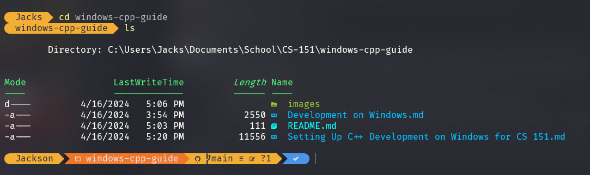

### Terminal
In short, a terminal (in a desktop context, anyways) is simply an application that acts as a front end for your shell. Most desktop environments come with a basic one, but you can download third-party terminals which offer better/advanced features.

Unless you have a preference as to which terminal emulator to use (in which case you probably don't need to read this guide), do yourself a favor and install the Windows Terminal, [found in the Windows Store](https://apps.microsoft.com/detail/9n0dx20hk701?hl=en-US&gl=US). It is highly customizable, and you can add any number of shells to it, including the Ubuntu shell ([guide found here](https://ddh4r4m.medium.com/how-to-add-ubuntu-tab-to-windows-10s-new-terminal-271eb6dfd8ee)). You can customize it visually with custom colors, backgrounds, and even shell prompts like [Oh My Posh](https://ohmyposh.dev/docs/installation/windows).

This is what my terminal/shell looks like after some customizations.


### PowerShell 7
It is *highly* recommended that you install PowerShell 7 in favor of Microsoft PowerShell (or PowerShell 1.0). Microsoft PowerShell ships with Windows by default and is missing *many* features compared to PowerShell 7.
Install it with the following command:

```bash
winget install Microsoft.Powershell
```

Post-installation, be sure to add it to your Terminal by going to **Settings** (ctrl + ,) --> **Profiles** --> **Add new profile**, and adding the path to the executable; chances are, it is already added. It's also recommended to make it your default shell; in my case, I removed the default PowerShell profile entirely. 

PowerShell is generally far more robust and scriptable than CMD, as it has access to the entire .NET ecosystem. Regardless, there may be scenarios in which CMD offers functionality that PS doesn't, so keep an eye out.

When customizing, you can find the path initialization script by typing `$profile` in PowerShell. To edit this script, add it as a parameter when running your editor of choice, i.e. `code $profile`. It's here that you'll initialize certain apps, set up aliases, and more.

### Linux Commands and their Windows Equivalent
For the most part, Linux commands line up with aliases on PowerShell fairly well: `ls`, `cd`, `cat`, `mkdir` and others work by default. Note that some operators like `||` and `&&` are only available on PowerShell 7.

One command which you will use in class which is not available by default is `hexdump`. With PowerShell, you can use `Format-Hex <file path>` to get a nicely formatted hex dump of the given file; I added an alias for this command in my PowerShell $profile like so: 

```ps1
Set-Alias hexdump Format-Hex
``` 